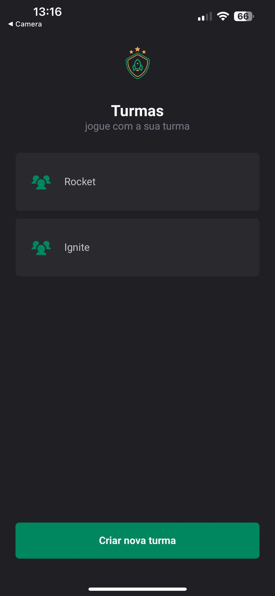
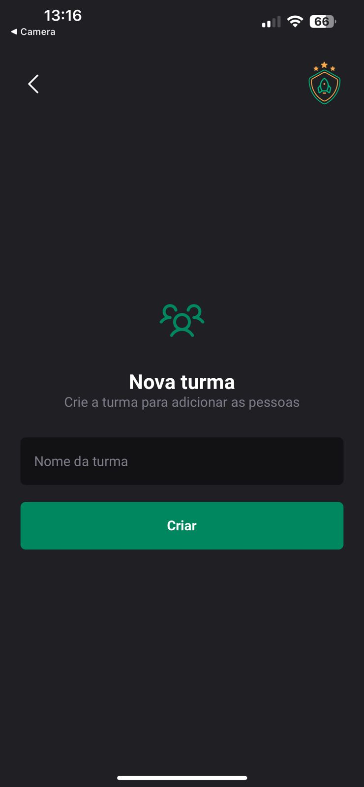
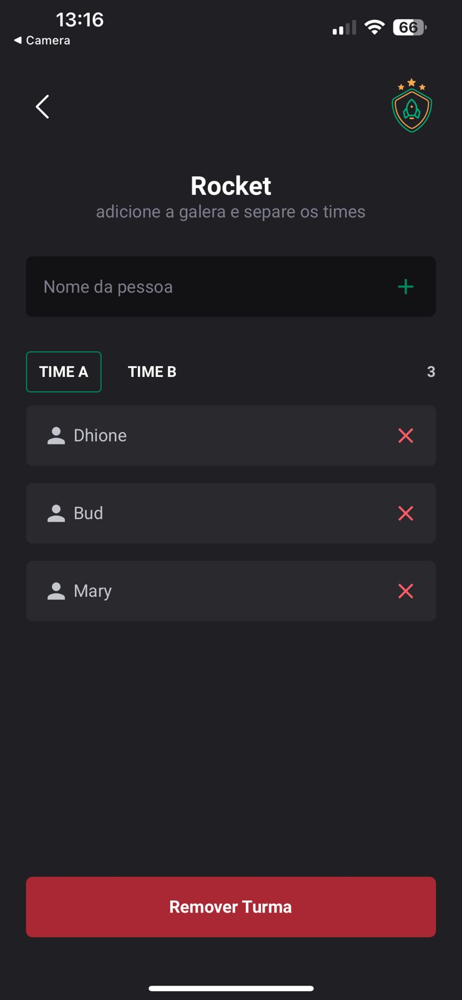

<h1 align="center">Welcome to IgniteTeam 👋</h1>
<p>
  
</p>

# IgniteTeam  

**IgniteTeam** is an application designed to help organize groups and teams for game matches. With this app, you can create groups, divide participants into teams, and manage team members easily and efficiently.
<div style="text-align: center; display: flex; justify-content: center; gap: 20px;">
 
  
  
</div>  

## Features  

- **Group Creation**: Organize people into dedicated groups.  
- **Team Management**: Within each group, you can create and manage teams as needed.  
- **Member Management**: Add or remove participants from teams with ease.  

## Technologies Used  

- **[Expo](https://expo.dev/)**: A framework for fast and efficient React Native app development.  
- **[React Native](https://reactnative.dev/)**: The foundation for building cross-platform mobile apps.  
- **[Styled-Components](https://styled-components.com/)**: A library for dynamic and customized component styling.  
- **JavaScript and TypeScript**: The core programming languages for building the app.  
- **Local Storage**: Data is stored locally on the user’s device, ensuring accessibility even offline.  

## Future Plans  

This is the initial version of IgniteTeam. Future updates will include additional features like cloud synchronization, user authentication, and more!  

## Install

```sh
npm install
```

## Usage

```sh
npx expor start
```

## Author

👤 **Dhione Castilho**


## Show your support

Give a ⭐️ if this project helped you!
